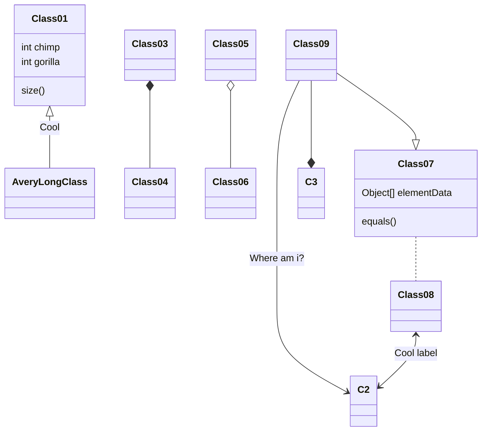

---

title: 【备忘录】工作与学习
comments: false
toc: true
categories: 备忘录
tags: [备忘录]
sticky: 100   # 文章排序
math: true    # 启动公式加载渲染
mermaid: true # 启动流程图渲染
index_img: /images/memo/index.jpg
author: Pony W
---

>  生活工作备忘录与待办事项。 <!-- more -->

### Google浏览器插件





Tampermonkey（油猴）是一款针对于浏览器运行脚本的插件，一款必装的浏览器插件神器。

可以去脚本市场 [greasyfork](https://greasyfork.org/zh-CN/scripts) 去下载自己想要的插件，非常实用。

这里推荐两个常用的脚本：

- [AC-baidu 重定向优化百度搜狗谷歌搜索；](https://greasyfork.org/zh-CN/scripts/14178-ac-baidu-重定向优化百度搜狗谷歌搜索-去广告-favicon-双列)
- 破解 VIP 会员视频集合。

[下载地址](https://chrome.google.com/webstore/detail/tampermonkey/dhdgffkkebhmkfjojejmpbldmpobfkfo?utm_source=chrome-ntp-icon)







可以发现网站上使用的技术。 它检测内容管理系统，电子商务平台，Web 框架，服务器软件，分析工具等。

[下载地址](https://chrome.google.com/webstore/detail/wappalyzer/gppongmhjkpfnbhagpmjfkannfbllamg?utm_source=chrome-ntp-icon)







当有太多的标签页时，单击OneTab图标，将所有标签页转换成一个列表。再次访问这些标签页时，可以单独或全部恢复它们。

[下载地址](https://chrome.google.com/webstore/detail/onetab/chphlpgkkbolifaimnlloiipkdnihall?utm_source=chrome-ntp-icon)







Adblock Plus 广告拦截器可有效的拦截所有网页上的所有类型的广告。

[下载地址](https://chrome.google.com/webstore/detail/adblock-plus-free-ad-bloc/cfhdojbkjhnklbpkdaibdccddilifddb?utm_source=chrome-ntp-icon)







这款神器可以GitHub平台代码在最左侧显示出树状目录，非常人性化的设计，你可以点击左侧目录切换到项目中的任意一个位置中去。

[下载地址](https://chrome.google.com/webstore/detail/octotree-github-code-tree/bkhaagjahfmjljalopjnoealnfndnagc)



### Hexo插件





​    Hexo 内容辅助插件，支持将类似 [reStructuredText](https://docutils.sourceforge.io/docs/ref/rst/directives.html) 的警告提示块添加到 Markdown 文档中。

​    [安装](https://github.com/lxl80/hexo-admonition)







​    将 hexo poats、类别和标签的统计数据呈现到图表中。

​    [安装](https://github.com/kuole-o/hexo-butterfly-charts)







​    Hexo 的 RSS3 部署插件。

   [安装](https://github.com/NaturalSelectionLabs/hexo-deployer-rss3) 







​    通过标签插件在 Hexo 帖子/页面中嵌入 KaTeX 和 MathJax。

​    [安装](https://github.com/hexojs/hexo-math)

数学公式
$$
E=mc^2
$$







​    在 Hexo 博客文章中支持 Markdown 脚注和 Wiki 样式工具提示参考的插件[^1]。

​    [安装](https://github.com/kchen0x/hexo-reference)

流程图









基于百度脑图的开源库 kityminder开发的hexo思维导图插件。

[安装](https://github.com/HunterXuan/hexo-simple-mindmap)

思维导图



- 知识图谱
  - Golang
  - Python
  - Java
    - JVM
 - 消息队列
   - Kafka
   - Pulsar










折叠博客内容,实现根据需要显示/隐藏博客内容[^2]。

[安装](https://github.com/unnamed42/hexo-spoiler)





内容








Hexo 博客备份

安装

```shell
$ npm install hexo-git-backup --save
```

配置

```shell
backup:
    type: git
    repository:
       github: git@github.com:xxx/xxx.git,branchName
```

命令

```
// hexo b
hexo backup
```



### npm与node环境更新

#### 更新记录

`npm install -g npm`更新npm失败

```shell
/usr/local/bin/npm -> /usr/local/lib/node_modules/npm/bin/npm-cli.js
/usr/local/bin/npx -> /usr/local/lib/node_modules/npm/bin/npx-cli.js
npm WARN notsup Unsupported engine for npm@8.2.0: wanted: {"node":"^12.13.0 || ^14.15.0 || >=16"} (current: {"node":"13.9.0","npm":"6.14.8"})
npm WARN notsup Not compatible with your version of node/npm: npm@8.2.0

+ npm@8.2.0
added 67 packages from 17 contributors, removed 287 packages and updated 147 packages in 4.402s
```

发现需要依赖的node版本不对

```shell
# 输入命令 npm install -g n
npm does not support Node.js v13.9.0
You should probably upgrade to a newer version of node as we
can't make any promises that npm will work with this version.
You can find the latest version at https://nodejs.org/
```

因此单独更新node

#### 更新node

##### 查看当前node版本

```shell
node –v
internal/modules/cjs/loader.js:983
  throw err;
  ^

Error: Cannot find module '/Users/wangpeng/Projects/MyProject/weitrue.github.io/–v'
    at Function.Module._resolveFilename (internal/modules/cjs/loader.js:980:15)
    at Function.Module._load (internal/modules/cjs/loader.js:862:27)
    at Function.executeUserEntryPoint [as runMain] (internal/modules/run_main.js:71:12)
    at internal/main/run_main_module.js:17:47 {
  code: 'MODULE_NOT_FOUND',
  requireStack: []
}
```

直接报错

#### 安装n模块

```shell
npm install -g n
```

#### 升级到指定版本/最新版本

`n v@version`

可以告诉管理器，安装最新的稳定版本

```shell
n stable
  installing : node-v16.13.1
       mkdir : /usr/local/n/versions/node/16.13.1
```

安装稳定版本

```shell
n v16.13.1
  installing : node-v16.13.1
       mkdir : /usr/local/n/versions/node/16.13.1
mkdir: /usr/local/n/versions/node/16.13.1: Permission denied

  Error: sudo required (or change ownership, or define N_PREFIX)
```

需要授权

```shell
sudo n v16.13.1
Password:
  installing : node-v16.13.1
       mkdir : /usr/local/n/versions/node/16.13.1
       fetch : https://nodejs.org/dist/v16.13.1/node-v16.13.1-darwin-x64.tar.xz
   installed : v16.13.1 (with npm 8.1.2)
```

检查是否安装成功

```
node -v
v16.13.1
```

#### 更新npm

```shell
npm install -g npm
npm ERR! code EACCES
npm ERR! syscall rename
npm ERR! path /usr/local/lib/node_modules/npm
npm ERR! dest /usr/local/lib/node_modules/.npm-i9nnxROI
npm ERR! errno -13
npm ERR! Error: EACCES: permission denied, rename '/usr/local/lib/node_modules/npm' -> '/usr/local/lib/node_modules/.npm-i9nnxROI'
npm ERR!  [Error: EACCES: permission denied, rename '/usr/local/lib/node_modules/npm' -> '/usr/local/lib/node_modules/.npm-i9nnxROI'] {
npm ERR!   errno: -13,
npm ERR!   code: 'EACCES',
npm ERR!   syscall: 'rename',
npm ERR!   path: '/usr/local/lib/node_modules/npm',
npm ERR!   dest: '/usr/local/lib/node_modules/.npm-i9nnxROI'
npm ERR! }
npm ERR!
npm ERR! The operation was rejected by your operating system.
npm ERR! It is likely you do not have the permissions to access this file as the current user
npm ERR!
npm ERR! If you believe this might be a permissions issue, please double-check the
npm ERR! permissions of the file and its containing directories, or try running
npm ERR! the command again as root/Administrator.

npm ERR! A complete log of this run can be found in:
npm ERR!     /Users/wangpeng/.npm/_logs/2021-12-07T02_12_59_256Z-debug.log
```

需要授权

```shell
npm install npm -g

changed 14 packages in 2s

10 packages are looking for funding
  run `npm fund` for details
```

#### 更新后带来问题

##### fluid主题`hero g`报错

```shell
exo g
INFO  Validating config
INFO  Start processing
INFO
------------------------------------------------
|                                              |
|     ________  __            _        __      |
|    |_   __  |[  |          (_)      |  ]     |
|      | |_ \_| | | __   _   __   .--.| |      |
|      |  _|    | |[  | | | [  |/ /'`\' |      |
|     _| |_     | | | \_/ |, | || \__/  |      |
|    |_____|   [___]'.__.'_/[___]'.__.;__]     |
|                                              |
|       Thank you for using Fluid theme !      |
|    Docs: https://hexo.fluid-dev.com/docs/    |
|                                              |
------------------------------------------------

FATAL {
  err: Error: Function yaml.safeLoad is removed in js-yaml 4. Use yaml.load instead, which is now safe by default.
      at Object.safeLoad (/Users/wangpeng/Projects/MyProject/weitrue.github.io/node_modules/js-yaml/index.js:10:11)
      at module.exports (/Users/wangpeng/Projects/MyProject/weitrue.github.io/themes/fluid/scripts/events/lib/merge-configs.js:32:24)
      at Hexo.<anonymous> (/Users/wangpeng/Projects/MyProject/weitrue.github.io/themes/fluid/scripts/events/index.js:7:33)
      at Hexo.emit (node:events:402:35)
      at Hexo._generate (/Users/wangpeng/Projects/MyProject/weitrue.github.io/node_modules/hexo/lib/hexo/index.js:452:10)
      at /Users/wangpeng/Projects/MyProject/weitrue.github.io/node_modules/hexo/lib/hexo/index.js:324:24
      at tryCatcher (/Users/wangpeng/Projects/MyProject/weitrue.github.io/node_modules/bluebird/js/release/util.js:16:23)
      at Promise._settlePromiseFromHandler (/Users/wangpeng/Projects/MyProject/weitrue.github.io/node_modules/bluebird/js/release/promise.js:547:31)
      at Promise._settlePromise (/Users/wangpeng/Projects/MyProject/weitrue.github.io/node_modules/bluebird/js/release/promise.js:604:18)
      at Promise._settlePromise0 (/Users/wangpeng/Projects/MyProject/weitrue.github.io/node_modules/bluebird/js/release/promise.js:649:10)
      at Promise._settlePromises (/Users/wangpeng/Projects/MyProject/weitrue.github.io/node_modules/bluebird/js/release/promise.js:729:18)
      at Promise._fulfill (/Users/wangpeng/Projects/MyProject/weitrue.github.io/node_modules/bluebird/js/release/promise.js:673:18)
      at Promise._resolveCallback (/Users/wangpeng/Projects/MyProject/weitrue.github.io/node_modules/bluebird/js/release/promise.js:466:57)
      at Promise._settlePromiseFromHandler (/Users/wangpeng/Projects/MyProject/weitrue.github.io/node_modules/bluebird/js/release/promise.js:559:17)
      at Promise._settlePromise (/Users/wangpeng/Projects/MyProject/weitrue.github.io/node_modules/bluebird/js/release/promise.js:604:18)
      at Promise._settlePromise0 (/Users/wangpeng/Projects/MyProject/weitrue.github.io/node_modules/bluebird/js/release/promise.js:649:10)
      at Promise._settlePromises (/Users/wangpeng/Projects/MyProject/weitrue.github.io/node_modules/bluebird/js/release/promise.js:729:18)
      at Promise._fulfill (/Users/wangpeng/Projects/MyProject/weitrue.github.io/node_modules/bluebird/js/release/promise.js:673:18)
      at PromiseArray._resolve (/Users/wangpeng/Projects/MyProject/weitrue.github.io/node_modules/bluebird/js/release/promise_array.js:127:19)
      at PromiseArray._promiseFulfilled (/Users/wangpeng/Projects/MyProject/weitrue.github.io/node_modules/bluebird/js/release/promise_array.js:145:14)
      at Promise._settlePromise (/Users/wangpeng/Projects/MyProject/weitrue.github.io/node_modules/bluebird/js/release/promise.js:609:26)
      at Promise._settlePromise0 (/Users/wangpeng/Projects/MyProject/weitrue.github.io/node_modules/bluebird/js/release/promise.js:649:10)
} Something's wrong. Maybe you can find the solution here: %s https://hexo.io/docs/troubleshooting.html
```

[解决办法](https://github.com/fluid-dev/hexo-theme-fluid/issues/446)

##### npm与node后引发问题-循环依赖

```shell
$ hexo s
INFO  Validating config
INFO  Start processing
INFO
------------------------------------------------
|                                              |
|     ________  __            _        __      |
|    |_   __  |[  |          (_)      |  ]     |
|      | |_ \_| | | __   _   __   .--.| |      |
|      |  _|    | |[  | | | [  |/ /'`\' |      |
|     _| |_     | | | \_/ |, | || \__/  |      |
|    |_____|   [___]'.__.'_/[___]'.__.;__]     |
|                                              |
|       Thank you for using Fluid theme !      |
|    Docs: https://hexo.fluid-dev.com/docs/    |
|                                              |
------------------------------------------------

INFO  Hexo is running at http://localhost:4000 . Press Ctrl+C to stop.
(node:87224) Warning: Accessing non-existent property 'lineno' of module exports inside circular dependency
(Use `node --trace-warnings ...` to show where the warning was created)
(node:87224) Warning: Accessing non-existent property 'column' of module exports inside circular dependency
(node:87224) Warning: Accessing non-existent property 'filename' of module exports inside circular dependency
(node:87224) Warning: Accessing non-existent property 'lineno' of module exports inside circular dependency
(node:87224) Warning: Accessing non-existent property 'column' of module exports inside circular dependency
(node:87224) Warning: Accessing non-existent property 'filename' of module exports inside circular dependency
```

google后，发现一位博主[修改nib@1.1.2依赖](https://www.haoyizebo.com/posts/710984d0/)，尝试后不成功。

于是，采用主流办法[node.js降级](https://github.com/hexojs/hexo/issues/4257)

```shell
 node -v
v12.22.7
```

后来发现**具体原因**是由于 [stylus](https://github.com/stylus/stylus) 导致的，stylus 在 0.54.8 版本修复了这个问题（见 pr [#2538](https://github.com/stylus/stylus/pull/2538) ）,所以重新装一下 `hexo-renderer-stylus` 就可以了[^3].

```shell
npm install hexo-renderer-stylus --save
```

##### Fluid主题LaTeX 数学公式需要更换渲染器

 MathJax 的老用户，需要将原 kramed 渲染器更换为 pandoc ，否则`hexo g`会报错


安装命令

```shell
npm uninstall hexo-renderer-kramed --save 
npm install hexo-renderer-pandoc --save
```

##### Hexo生成页面缺失问题

网上有三种情况：

1.缺失相应包文件

这里备份一下所需的基本文件


2.缺失相应配置文件

3._post目录下没有`.md`文件

[^1]:  [测试](https://en.wikipedia.org/wiki/Markdown)
[^2]:[Hexo Fluid 代码折叠](https://wty-yy.github.io/posts/44830/)
[^3]:[解决 Hexo 在使用 Node.js 14 时的 Accessing non-existent property 'xxx' of module exports inside circular dependency 问题](https://www.haoyizebo.com/posts/710984d0/)
